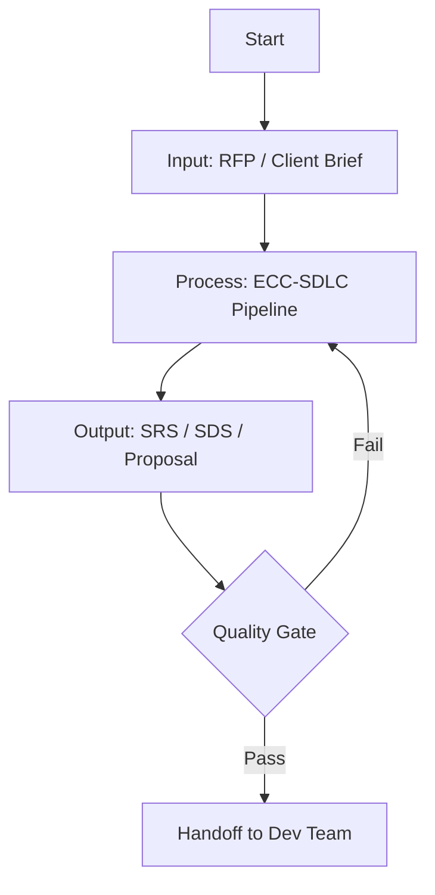

# Mermaid CLI Verification Test

Run this file through `mmdc` to confirm Mermaid CLI is working on your machine.

## Test Command

```bash
mmdc -i test-fixtures/test-mermaid.md -o test-fixtures/test-output.svg
```

Then open `test-fixtures/test-output.svg` in a browser — the diagram must render correctly.

If `mmdc` is not on PATH, use the npx fallback:

```bash
npx @mermaid-js/mermaid-cli -i test-fixtures/test-mermaid.md -o test-fixtures/test-output.svg
```

## Expected Result

- `test-output.svg` is created in `test-fixtures/`
- File starts with `<svg` and ends with `</svg>`
- Opening in browser shows a valid flowchart with four nodes (Start → Input → Process → Output)

Log your result in `test-fixtures/smoke-test-results.md` before Sprint 2 Day 1 noon.

---

## Diagram


